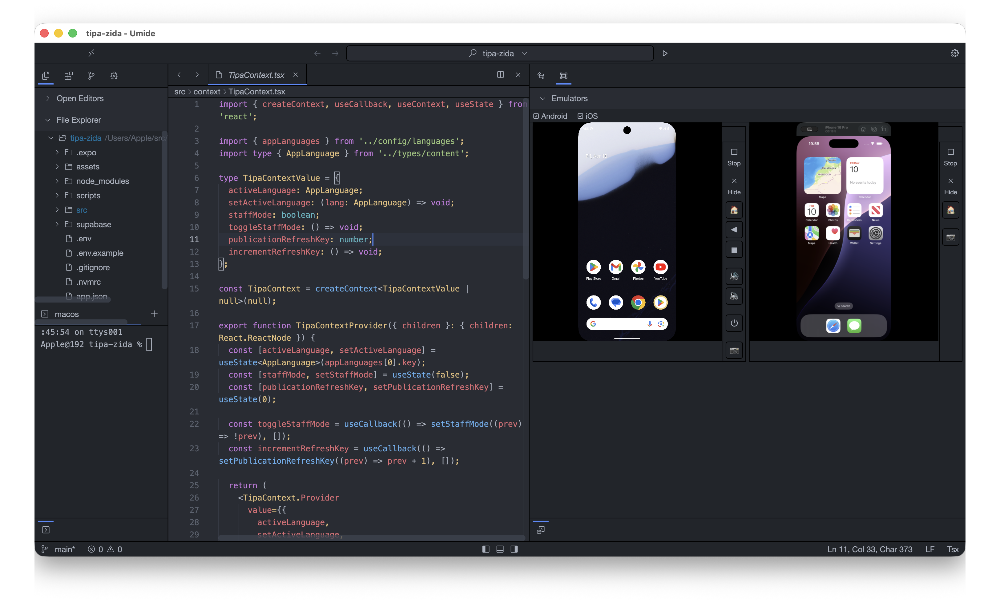
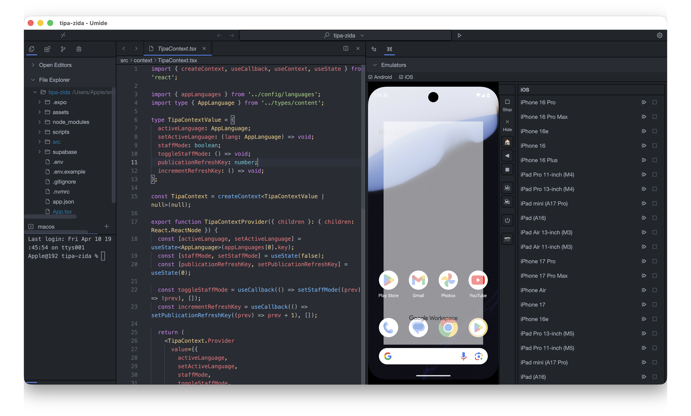
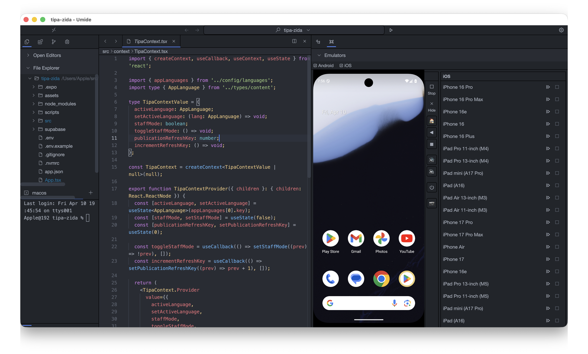
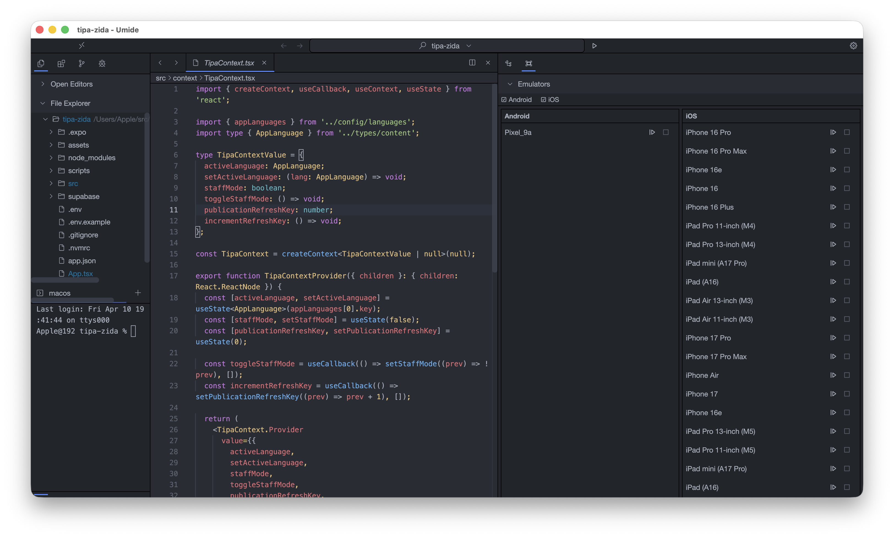

<h1 align="center">
  UMIDE
</h1>

<h4 align="center">The Unified IDE for Cross-Platform Mobile Development</h4>

UMIDE is a unified IDE for cross-platform mobile development (React Native + Flutter), built in Rust. It embeds Android Emulator and iOS Simulator directly as panels, eliminating context-switching for mobile developers.

## Screenshots

## Features

- **Unified Mobile Environment**: Android Emulator and iOS Simulator embedded directly in the IDE.
- **Cross-Platform Support**: First-class support for React Native and Flutter.
- **High Performance**: Built on [Floem](https://github.com/lapce/floem) and Rust for lightning-fast speeds.
- **Based on Umide**: Inherits all the great features of Umide editor.

## License

Copyright 2026 UMIDE contributors
Portions (original editor) Copyright 2023 Umide contributors

Released under the Apache License Version 2.
